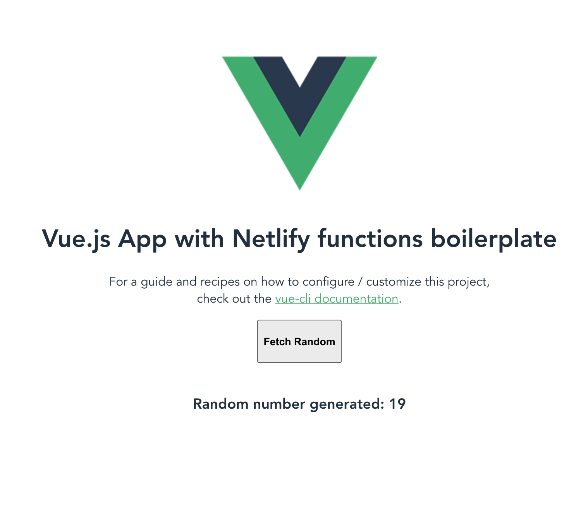

# Vuejs with netlify-lambda 



You can check me running live 
<a href="https://nfunctions-vue.netlify.app" target = "_blank">HERE </a>

## setup used from 

[netlify-functions-with-vue-cli](https://www.bensheedy.com/blog/netlify-functions-with-vue-cli/)

### Nelify functions 

To access and create new functions they must be added inside the folder `src/functions`. 

At runtime they will be built and made available here: `http://localhost:8080/.netlify/functioms/[function name & parmas]`


## Project setup
```
yarn install
```

### Compiles and hot-reloads for development
```
yarn run serve
```


### Compiles and minifies for production
```
yarn run build
```

### Run your tests
```
yarn run test
```

### Lints and fixes files
```
yarn run lint
```

### Customize configuration
See [Configuration Reference](https://cli.vuejs.org/config/).
